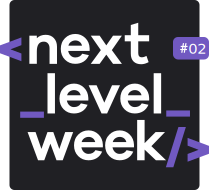
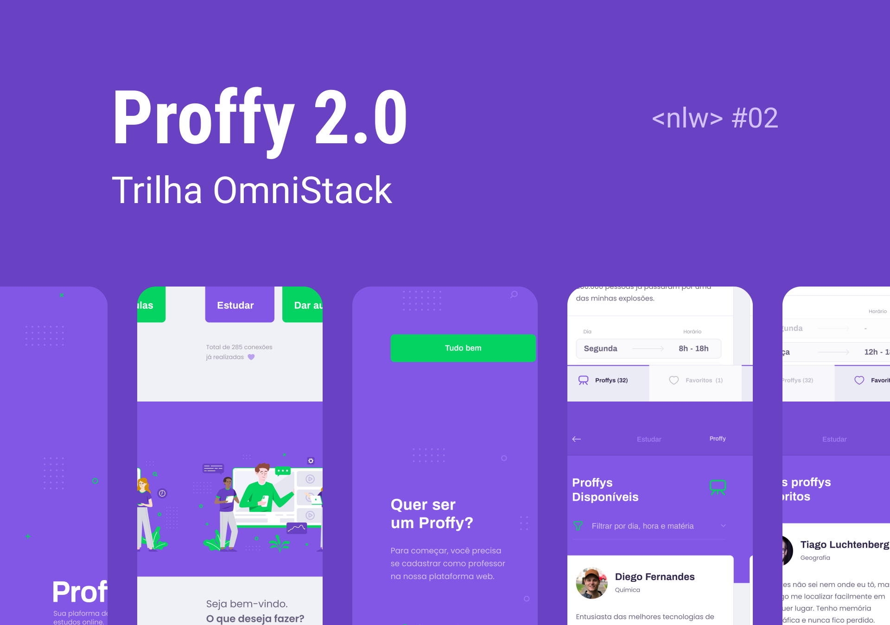

<h1 align="center">
    
</h1>

<h3 align="center">Next Level Week :rocket: </h1>

<h1 align="center">

[](https://insomnia.rest/run/?label=nlw-02&uri=https%3A%2F%2Fgithub.com%2Fdefauth98%2Fnlw-02%2Fblob%2Fmaster%2FInsomnia_2020-08-11.json)

</h1>

### :shrug: O que é a Next Level Week?

A semana next level foi um evento que ocorreu no dia 3 até o dia 8 de Agosto, onde desenvolvemos uma aplicação de ponta a ponta, desde o backend, frontend e mobile, usando ReactJS, React Native e NodeJS.

### :exploding_head: Qual é o objetivo do projeto?

Durante essa semana de muito networking e muito código, foi contruido uma aplicação para professores se conectarem com os seus alunos.

<h2 align="center">Proffy 👨‍🎓 </h2>

<h1 align="center">
    
</h1>

## Novas funcionalidades (Versão 2.0)

- [x] Autenticação de usuários
- [x] Recuperação de senhas
- [x] Perfil do proffy
- [x] Splash Screen no React Native
- [x] Paginação na listagem de proffys
- [ ] Exibindo horários disponiveis dos proffys
- [x] Salvando seus proffys favoritos
- [x] Logout da aplicação
- [ ] Deploy da aplicação

## :computer: Tecnologias

Esse projeto foi desenvolvido com as seguintes técnologias:

- [Node.js][nodejs]
- [TypeScript][typescript]
- [React][reactjs]
- [React Native][rn]
- [Expo][expo]

[nodejs]: https://nodejs.org/
[typescript]: https://www.typescriptlang.org/
[expo]: https://expo.io/
[reactjs]: https://reactjs.org
[rn]: https://facebook.github.io/react-native/
[yarn]: https://yarnpkg.com/

## :file_folder: Como acessar o layout

O layout foi contruido usando o figma, você acessa-lo com esse link: [Projeto no Figma](https://www.figma.com/file/GHGS126t7WYjnPZdRKChJF/?viewer=1&node-id=).

## Como rodar o backend

```sh
# Entrar na pasta do projeto backend
cd server

### Instalar as depedencias usando yarn
yarn

### Rodar as migrations
yarn migrate

#Rodar o projeto
yarn start
```

## Como rodar o frontend

```sh
# Entrar na pasta do projeto backend
cd web

# Instalar as depedencias usando yarn
yarn

#Rodar o projeto
yarn start
```

## Como rodar o mobile

```sh
# Entrar na pasta do projeto backend
cd mobile

# Instalar as depedencias usando yarn
yarn

#Rodar o projeto
yarn start
```

## Autor

👤 **Daniel Ribeiro**

- Twitter: [@defauth8](https://twitter.com/defauth8)
- Github: [@defauth98](https://github.com/defauth98)
- LinkedIn: [@daniel-ribeiro-397604164](https://linkedin.com/in/daniel-ribeiro-397604164)

<h4 align="center">Com ❤️ por Daniel Ribeiro</h3>
