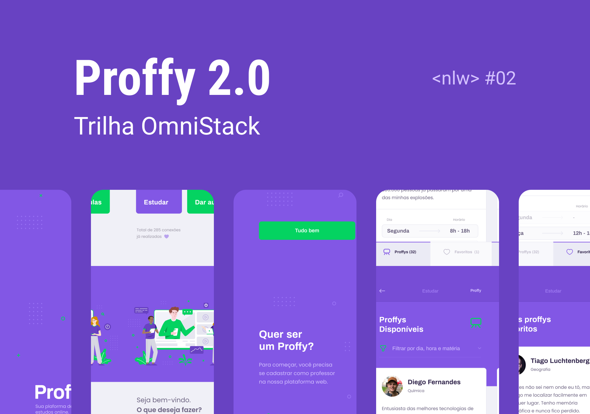

<h1 align="center">Proffy 👨‍🎓 </h1>

<p align="center">
  <a href="#user-content-computer-projeto">Projeto</a>&nbsp;&nbsp;&nbsp;|&nbsp;&nbsp;&nbsp;
  <a href="#user-content-boom-funcionalidades-da-versão-20">Funcionalidades da versão 2.0</a>&nbsp;&nbsp;&nbsp;|&nbsp;&nbsp;&nbsp;
  <a href="#user-content--tecnologias">Tecnologias</a>&nbsp;&nbsp;&nbsp;|&nbsp;&nbsp;&nbsp;
  <a href="#user-content-rocket-como-rodar-o-projeto">Como rodar o projeto?</a>&nbsp;&nbsp;&nbsp;|&nbsp;&nbsp;&nbsp;
  <a href="#user-content-autor">Autor</a>
</p>

<p align="center">
  
</p>

<h1 align="center">
  <a 
  href="https://insomnia.rest/run/?label=Proffy%20Backend%20API&uri=https%3A%2F%2Fgithub.com%2Fdefauth98%2Fproffy%2Fblob%2Fmaster%2Fserver%2FInsomnia_2020-10-27.json" 
  target="_blank"  ></a>
</h1>


### :computer: Projeto 

Plataforma WEB e Mobile, para os alunos poderem encontrar suas aulas, e entrar em contato com os professores


[Link da aplicação](https://proffy-deploy-frontend.netlify.app/)

### :boom: Funcionalidades da versão 2.0

- Autenticação de usuários
- Recuperação de senhas
- Perfil do proffy
- Splash Screen no React Native
- Paginação na listagem de proffys
- Exibindo horários disponiveis dos proffys
- Salvando seus proffys favoritos
- Logout da aplicação
- Deploy da aplicação

### ✨ Tecnologias

Esse projeto foi desenvolvido com as seguintes tecnologias:

- [Node.js][nodejs]
- [TypeScript][typescript]
- [React][reactjs]
- [React Native][rn]
- [Expo][expo]
- [Vite][vite]
- [PostgreSQL][postgresql]
- [Docker][docker]
- [pnpm][pnpm]

[nodejs]: https://nodejs.org/
[typescript]: https://www.typescriptlang.org/
[expo]: https://expo.io/
[reactjs]: https://reactjs.org
[rn]: https://facebook.github.io/react-native/
[vite]: https://vitejs.dev/
[postgresql]: https://www.postgresql.org/
[docker]: https://www.docker.com/
[pnpm]: https://pnpm.io/

### :rocket: Como rodar o projeto?

O projeto usa **pnpm**, **Vite** no frontend web e **PostgreSQL via Docker** para o banco local.

#### Pré-requisitos

- Node.js
- pnpm
- Docker e Docker Compose

#### Instalação

```bash
# Clone a aplicação
git clone https://github.com/defauth98/proffy.git
cd proffy

# Instale as dependências de web, server e mobile
make install
```

Também é possível instalar por projeto:

```bash
pnpm --dir web install
pnpm --dir server install
pnpm --dir mobile install
```

#### Setup do banco de dados

O banco local é iniciado via Docker usando `server/docker-compose.yml`.

```bash
# Inicia o PostgreSQL local
make db-up

# Executa as migrations
make migrate
```

Para recriar o banco e rodar os seeds:

```bash
make seed
# ou
make db-reset
```

Para parar o banco:

```bash
make db-down
```

Para acompanhar os logs do banco:

```bash
make db-logs
```

#### Variáveis de ambiente do backend

O backend usa o arquivo `server/.env`. Existe um exemplo em `server/.env-example`.

Configuração local padrão:

```env
SECRET=proffy-local-secret
PORT=3333

PGHOST=localhost
PGUSER=postgres
PGPASSWORD=docker
PGDATABASE=proffy
PGPORT=5432

SMTP_HOST=
SMTP_PORT=
SMTP_USER=
SMTP_PASSWORD=
```

#### Variáveis de ambiente do frontend web

Em desenvolvimento, o frontend está configurado para usar a API local:

```env
VITE_API_URL=http://localhost:3333
```

Esse valor fica em `web/.env.development`.

#### Rodando em desenvolvimento

Para subir banco, backend e frontend web juntos:

```bash
make dev
```

Para rodar individualmente:

```bash
# Apenas frontend web
make dev-web

# Apenas backend, iniciando o banco antes
make dev-server

# Apenas mobile
make dev-mobile
```

#### Build do frontend web

```bash
make build-web
```

#### Portas configuradas

| Serviço | Porta | URL |
| --- | ---: | --- |
| Frontend web Vite | 5173 | http://localhost:5173 |
| Backend API | 3333 | http://localhost:3333 |
| PostgreSQL | 5432 | localhost:5432 |
| Expo mobile | 8081/19000+ | definido pelo Expo |

### Autor

👤 **Daniel Ribeiro**

- Twitter: [@defauth8](https://twitter.com/defauth8)
- Github: [@defauth98](https://github.com/defauth98)
- LinkedIn: [@daniel-ribeiro-397604164](https://linkedin.com/in/daniel-ribeiro-397604164)
